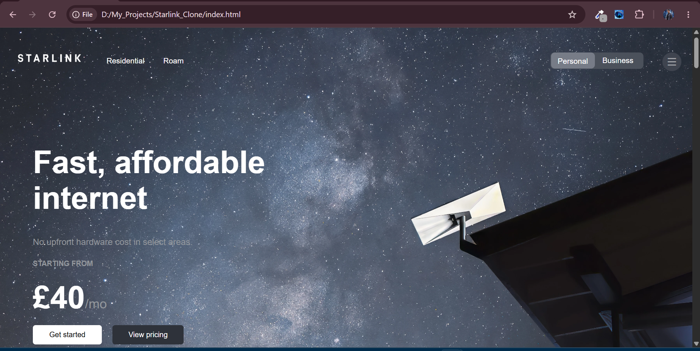

# 🚀 Starlink Landing Page Clone

A responsive front-end clone of the official Starlink landing page built using **HTML5** and **CSS3**. This project was created to improve my front-end development skills by recreating a modern, real-world website.

## 📸 Preview



---

## ✨ Features

- Responsive landing page
- Modern navigation bar
- Full-screen hero sections
- Background images with overlays
- Pricing cards
- Multiple content sections
- Image gallery
- Call-to-action buttons
- Professional footer
- Clean and organized HTML & CSS

---

## 🛠️ Technologies Used

- HTML5
- CSS3
- Remix Icons

---

## 📂 Project Structure

```
Starlink-Landing-Page-Clone/
│── index.html
│── starlink.css
│── README.md
```

---

## 🎯 What I Learned

While building this project, I improved my understanding of:

- HTML semantic elements
- CSS positioning
- Flexbox
- Background images
- Object-fit
- Typography
- Spacing and alignment
- Responsive layouts
- Real-world website cloning

---

## 🚀 How to Run

1. Clone the repository

```bash
git clone https://github.com/YOUR_USERNAME/Starlink-Landing-Page-Clone.git
```

2. Open the project folder.

3. Run `index.html` in your browser.

---

## 📌 Project Status

✅ Completed

---

## 🙋‍♂️ Author

**Abuzar Ansari**

- GitHub: https://github.com/abuzaransaridev

---

## ⭐ Acknowledgement

This project is created for educational and learning purposes only.  
The original design belongs to **Starlink (SpaceX)**.
